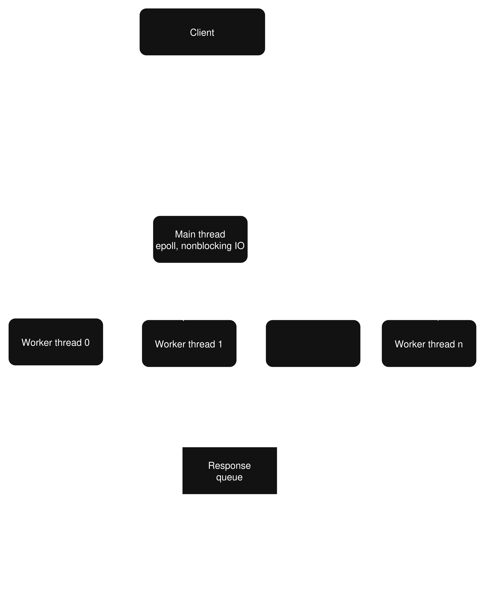

# IoT Gateway

A multithreaded IoT gateway daemon written in C for Linux. It exposes a **TLS-secured** binary TCP protocol
(JSON payload) for controlling sensors/actuators, plus a UDP discovery service.

## Architecture


- **main_thread**: single-threaded `epoll` loop, only does I/O (accept, read, write). Never
  runs business logic.
- **worker pool** (4 threads): pulls tasks from a bounded queue, talks to sensors/actuators,
  pushes results to a response queue.
- **eventfd**: wakes `main_thread` up when a worker has a response ready.
- Frame format: `header (16 bytes) + JSON payload + CRC32 (4 bytes)`. See
  `docs/protocol_spec.json` for the full message spec.

## Build

```bash
make          # builds gateway, gwctl, gwauto
make clean
```

## Programs

| Binary | Purpose |
|---|---|
| `gateway` | The server daemon. |
| `gwctl` | One-shot CLI tool to send a single request and print the response. Good for manual testing. |
| `gwauto` | Long-running client. Polls sensors every 5s and auto-controls actuators based on thresholds. |

## Usage

Start the gateway:
```bash
./gateway
```

Run the automation client:
```bash
./client 127.0.0.1 5555
```
It reconnects automatically if the connection drops, and only sends a `SET_ACTUATOR` command
when a decision actually changes (not every 5s), to avoid spamming the gateway/hardware.
Thresholds are `#define`s at the top of `tools/gwauto.c`.

## Project layout

```
include/     header files
src/         gateway implementation
tools/       gwctl.c, gwauto.c, demo_uaf.c (bug repro for ASan/Valgrind demo)
docs/        protocol_spec.json, debugging tools guide
```

## Debugging

UBSan, Valgrind, strace, ltrace, tcpdump and perf on this project, including two real bugs that
were found and fixed using `strace`, `gdb`, `assantizer`


## Known limitations

- No authentication/TLS on the TCP channel.
- No OTA update, no MQTT/cloud integration.
- Single gateway instance, no clustering.

## update
- Have TLS handshake in soon